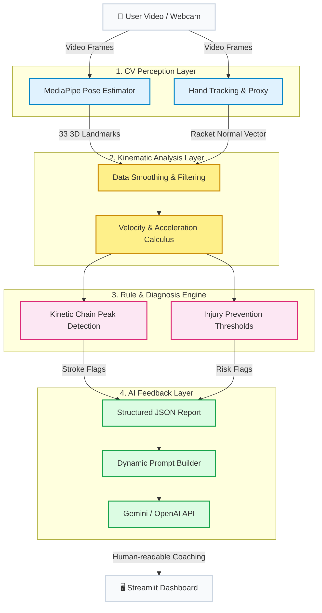

# 🏸 Badminton AI Coach: Biomechanical Analysis & LLM Feedback

<p align="center">
  
  
  
  
</p>

## 📖 Project Overview

An AI-powered badminton coaching system leveraging Computer Vision (CV) and Large Language Models (LLMs). 

Unlike traditional "pose-matching" applications, this project focuses on **sports biomechanics and kinetic chain analysis**. By extracting 3D skeletal landmarks frame-by-frame and applying kinematic calculus (velocity/acceleration peaks), the system objectively evaluates stroke fluidity, identifies potential injury risks (e.g., tennis elbow, rotator cuff strain), and uses generative AI to translate complex mathematical thresholds into actionable, human-readable coaching feedback.

## ✨ Key Features

- **🦾 Kinetic Chain Analysis:** Tracks the time differential between shoulder, elbow, and wrist velocity peaks to determine if the user is effectively utilizing the "whip effect" (sequential force transfer).
- **🛡️ Injury Prevention Alerts:** Monitors critical joint angles at the point of impact (e.g., flagging elbow hyperextension > 175°) to prevent common racket sports injuries.
- **🏸 Racket Face Proxy (Hand Tracking):** Innovatively utilizes MediaPipe Hand Landmarks to estimate forearm pronation and racket face orientation during impact.
- **🧠 Generative AI Feedback:** Converts JSON-formatted biomechanical flags into structured prompts, utilizing LLMs to provide professional, encouraging, and tailored coaching advice.

## 🛠️ Technology Stack

- **Perception (CV):** Google MediaPipe (Pose & Hands), OpenCV
- **Analysis (Math & Signal Processing):** NumPy, SciPy (data smoothing, peak detection, derivatives)
- **Frontend / UI:** Streamlit
- **AI Integration:** OpenAI API / Google Gemini API

## 🏗️ System Architecture

The project follows a highly decoupled, four-layer data pipeline. By separating computer vision inference from mathematical analysis and LLM generation, the system ensures high maintainability and allows for future model swaps (e.g., upgrading from MediaPipe to YOLOv8) without breaking the core logic.



### 1. Perception Layer (Computer Vision)
Acts as the eyes of the system. It processes raw video frames and extracts 33 3D human pose landmarks using MediaPipe. A parallel sub-module tracks hand landmarks to create a proxy vector for the racket face, estimating forearm pronation. This layer outputs pure numerical matrices (coordinates).

### 2. Kinematic Analysis Layer (Math & Physics)
Transforms raw spatial coordinates into physical motion data. It applies signal smoothing (e.g., Savitzky-Golay filters) to remove camera jitter, and computes the first and second derivatives (velocity and acceleration) over time for critical joints like the shoulder, elbow, and wrist.

### 3. Rule & Diagnosis Engine (Biomechanics)
The core "domain logic" of the application. It applies sports science rules to the kinematic data:

- Kinetic Chain: Checks the sequential timing of velocity peaks (Shoulder → Elbow → Wrist) to verify the "whip effect".

- Safety Thresholds: Flags dangerous mechanics, such as an elbow angle > 175° at the point of impact.

### 4. AI Feedback Layer (Generative LLMs)
Converts the hard data into an empathetic, professional coaching experience. It packages the triggered biomechanical flags into a structured JSON prompt, requesting the LLM (Gemini/OpenAI) to explain the "why" and "how to fix it" in natural language, avoiding hallucinated mathematical calculations.

## 🚀 Quick Start

### 1. Clone the Repository
```bash
git clone [https://github.com/your-username/badminton-coach-ai.git](https://github.com/your-username/badminton-coach-ai.git)
cd badminton-coach-ai
```
### 2. Set Up the Environment
It is recommended to use a virtual environment:

```
python -m venv venv
source venv/bin/activate  # On macOS/Linux
```

```
# .\venv\Scripts\activate # On Windows
pip install -r requirements.txt
```

### 3. Configure Environment Variables
Copy the environment template and add your LLM API key:

```
cp .env
# Open .env and insert your OPENAI_API_KEY or GEMINI_API_KEY
```

### 4. Run the Application
Bash
streamlit run app.py
## 🗺️ Development Roadmap
This project follows an agile development lifecycle, broken down into the following phases:

- Phase 1: Data Extraction & Proof of Concept (PoC)

Integrate MediaPipe for frame-by-frame 3D landmark extraction.

Plot velocity/time curves for key joints in Jupyter Notebooks.

- Phase 2: Biomechanics & Rule Engine

Implement coordinate smoothing and kinematic calculus in biomechanics.py.

Define mathematical thresholds for broken kinetic chains and high-risk postures.

- Phase 2.5: Racket Proxy Implementation

Extract hand landmarks to calculate the normal vector, estimating racket orientation and pronation.

- Phase 3: LLM Integration & MVP Web UI

Build the interactive Streamlit dashboard.

Establish the Data -> JSON -> Prompt -> LLM Feedback pipeline.

- Phase 4: Real-Time Live Streaming

Implement async/multithreading to support live webcam input with zero-latency visual feedback.

## 📁 Repository Structure
```
badminton-coach-ai/
├── app.py                 # Streamlit UI entry point
├── notebooks/             # Jupyter notebooks for algorithmic PoC & data viz
├── src/                   # Core modules
│   ├── cv/                # Pose detection and racket proxy tracking
│   ├── analysis/          # Kinematics math and rule engine definitions
│   ├── llm/               # Prompt builders and API clients
│   └── utils/             # Video processing and OpenCV drawing utilities
├── data/                  # Local assets (videos/outputs) - ignored in Git
└── requirements.txt       # Python dependencies
```

## 🤝 Contributing & License
Created by Ryan. Feel free to open issues or submit Pull Requests if you are interested in sports AI and biomechanics!
